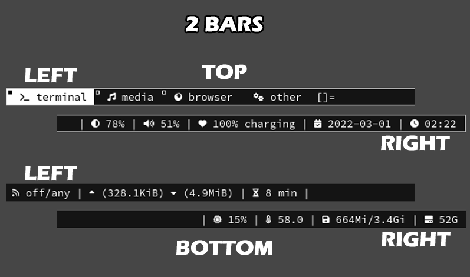

# MOKU'S DYNAMIC WINDOW MANAGER



## DWM PATCHES APPLIED

- **BORDER BAR**: Changeable size top border bar.
- **EXTRA BAR**: This patch will enable an extra status bar in dwm.
- **3 STATUS BAR**: 3 statuses, 1 in top right, 2 in left/right bottom
- **NO TITLE**: Doesn't show the title.
- **SWALLOW**: This patch adds "window swallowing" to dwm as known from Plan 9's windowing system rio.
- **VANITY GAPS**: gaps between windows and the screen edge in a flexible manner.


## Installation

1. go in the main user directory, and type `git clone https://github.com/MokuKen/MDWM.git`. then press ENTER
2. go inside the repository `cd MDWM/dwm`
3. and install it `sudo make clean install` or `sudo make install`
6. Restart dwm
7. Enjoy your new MDWM!!


## KEYBINDINGS

- EVERYTHING IS SET TO DEFAULT
- OPEN A POWERMENU SHIFT + ALT + S
- OPEN DMENU CTRL + G
- OPEN A TERMINAL SHIFT + ALT + ENTER
- CLOSE A WINDOW SHIFT + ALT + C
- QUIT DWM SHIFT + ALT + Q
- CHANGE LAYOUT ALT + D OR ALT + I

```

